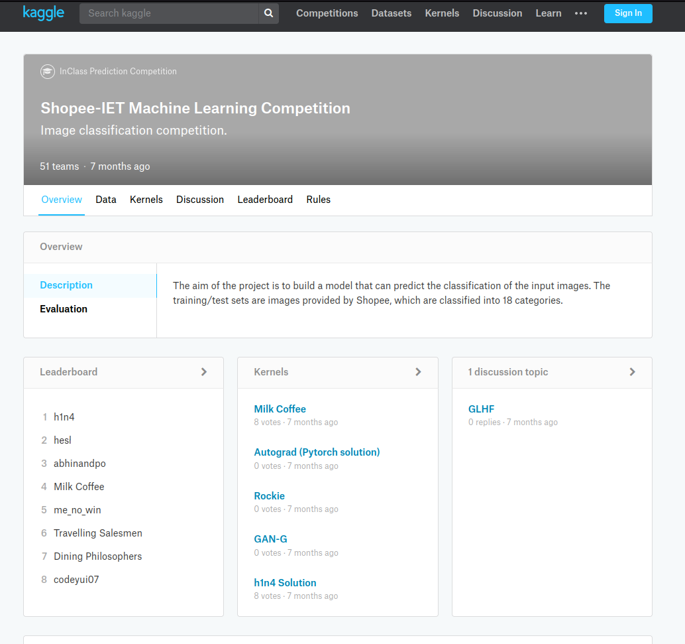

# shopee-ml-kaggle-competition

This repository contains codes for the <u>Shopee-IET Machine Learning Kaggle Competition</u> (Achieved rank 2 out of 51). The work was done during my internship at the Nanyang Technological University, Singapore in Spring 2018.

Contest page link: <s>https://www.kaggle.com/c/shopee-iet-machine-learning-competition#description</s> (Competition page have been removed.)

Leaderboard link (team name - hesl): <s>https://www.kaggle.com/c/shopee-iet-machine-learning-competition/leaderboard</s> (Competition page have been removed.)

Used a deep learning based ensemble model and a few data augmentation techniques to obtain top performance in the above challenge.
Approach is explained in the presentation.pptx file

Prerequisites:
1. Python 3
2. Pytorch 0.3

Main scripts:
1. train.py - Trains a model on the given data
2. train_top5.py - Writes the top 5 predictions with their confidence for trained model on the training data.
3. test.py - tests the model and outputs predictions
4. test_top5.py - Predicts the top 5 classes along with their confidence on test data.
5. ensemble_optimal.py - Uses the top 5 predictions of each model to give final prediction

Competition Snap:

Contributors:
1. [Punit Bhatt](https://github.com/punit-bhatt) (Microsoft, India)
2. [Rydel Dcosta](https://github.com/rydeldcosta) (Morgan Stanley, India)
3. [Omkar Damle](https://github.com/omkar13) (New York University, United States)
